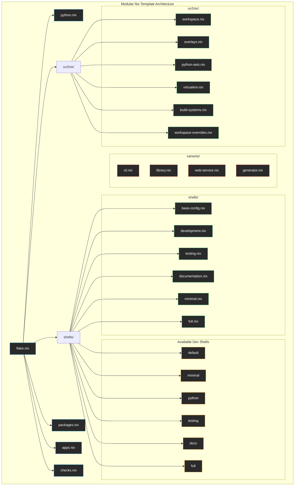

# Nix Configuration Architecture

This directory contains the modular Nix configuration for the Python template, providing a highly organized and maintainable setup that integrates UV and Nix seamlessly.

## Architecture Overview



## Directory Structure

```
nix/
├── README.md              # This file - overall architecture
├── python.nix             # Python project metadata
├── checks.nix             # Test configurations
├── uv2nix/                # UV+Nix integration (see uv2nix/README.md)
├── shells/                # Development shells (see shells/README.md)
├── packages/              # Package definitions (see packages/README.md)
├── apps/                  # Application definitions (see apps/README.md)
└── variants/              # Project templates (see variants/README.md)
```

## Core Modules

### 🐍 [python.nix](./python.nix)
Defines the Python project specification with support for both single packages and monorepo workspaces:
- **Project metadata**: `projectName`, `projectRoot`, `projectDir`
- **Monorepo support**: `workspaces` list for multiple packages
- **Empty root support**: `emptyRoot` flag for workspace-only repositories
- Used by UV2NIX modules for workspace discovery and virtual environment creation

**Project Spec Structure:**
```nix
{
  # Parent-only fields (only valid for root spec)
  emptyRoot = false;    # Does root workspace contain a Python package?
  workspaces = [];      # List of workspace specs for monorepo layout
  
  # Core project spec fields
  projectName = "name"; # Corresponds to project.name in pyproject.toml
  projectRoot = ./path; # Location of pyproject.toml
  projectDir = ./src;   # Optional: source directory (defaults to projectRoot/src/<sanitized projectName>)
}
```

### 🔧 [uv2nix/](./uv2nix/)
Complete UV+Nix integration system:
- Workspace discovery and loading
- Package overlay management
- Python environment construction
- Virtual environment creation
- Build system overrides

### 🐚 [shells/](./shells/)
Modular development shell system:
- Base configuration for composition
- Specialized environments (testing, docs, etc.)
- Clean inheritance hierarchy
- Easy extensibility

### 📦 [variants/](./variants/)
Project template system:
- CLI application template
- Library template  
- Web service template
- Template generation utilities

### 🎯 [apps/](./apps/)
Modular application system providing runnable apps:
- Python workspace applications 
- Custom development scripts
- Workflow automation tools
- External tool wrappers

### 📦 [packages/](./packages/)
Modular package management system:
- Python workspace packages
- Custom utility packages
- Shell script packages
- Development tool packages

### ✅ [checks.nix](./checks.nix)
Configures automated testing with pytest and coverage reporting.

## Design Principles

### 1. **Modularity**
Each component has a single responsibility and can be modified independently.

### 2. **Composition**
Components build upon each other rather than duplicating functionality.

### 3. **Non-Recursive**
Uses `let` expressions instead of `rec` to avoid evaluation issues.

### 4. **Clear Dependencies**
Explicit data flow between modules makes the system easier to understand.

### 5. **Extensibility**
New shells, overrides, or variants can be added without modifying existing code.

## Python Project Configuration

### Single Package Layout (Current)
```nix
# nix/python.nix
let
  repoRoot = ../.;
  sanitizeName = name: builtins.replaceStrings ["-"] ["_"] name;
in {
  emptyRoot = false;
  workspaces = [];
  projectName = "template";
  projectRoot = repoRoot;
  projectDir = repoRoot + "/src/" + sanitizeName "template";
}
```

### Monorepo Workspace Layout (Future)
```nix
# nix/python.nix
let
  repoRoot = ../.;
  sanitizeName = name: builtins.replaceStrings ["-"] ["_"] name;
in {
  emptyRoot = true;  # Root contains no Python package
  workspaces = [
    {
      projectName = "core";
      projectRoot = repoRoot + "/packages/core";
      projectDir = repoRoot + "/packages/core/src/core";
    }
    {
      projectName = "cli";
      projectRoot = repoRoot + "/packages/cli";
      # projectDir defaults to projectRoot/src/cli
    }
  ];
  # Root-level fields are only for monorepo configuration
  projectName = "workspace-root";  # Not used when emptyRoot = true
  projectRoot = repoRoot;
}
```

### Custom Source Layout
```nix
# For non-standard directory structures
{
  emptyRoot = false;
  projectName = "myproject";
  projectRoot = repoRoot;
  projectDir = repoRoot + "/custom/source/path";  # Override default
}
```

## Usage Examples

### Development Shells
```bash
# Default development environment (base + python)
nix develop

# Minimal environment (just base tools)
nix develop .#minimal

# Testing environment (development + test tools)
nix develop .#testing

# Documentation environment (development + doc tools)  
nix develop .#docs

# Full environment (everything)
nix develop .#full
```

### Running Applications
```bash
# Project management
nix run .#init         # Initialize project environment
nix run .#clean        # Clean project artifacts  
nix run .#status       # Show development status

# Development workflow
nix run .#test-all     # Run all tests
nix run .#lint-all     # Run all linters
nix run .#format-all   # Format all code

# Web development
nix run .#dev-server   # Start development server
```

### Running Tests
```bash
# Run all checks (comprehensive)
nix run .#test-all

# Run just Nix checks
nix flake check

# Build test results
nix build .#checks.x86_64-linux.template-pytest
```

### Building Packages
```bash
# Build the main package
nix build

# Build specific workspace package
nix build .#template

# Build custom utilities
nix build .#project-clean
nix build .#dev-status
```

## Benefits

- ✅ **Maintainable**: Clear separation of concerns
- ✅ **Extensible**: Easy to add new functionality
- ✅ **Reliable**: Non-recursive architecture prevents evaluation issues
- ✅ **Efficient**: Composition avoids duplication
- ✅ **Tested**: Comprehensive test integration
- ✅ **Documented**: Each module has clear documentation
