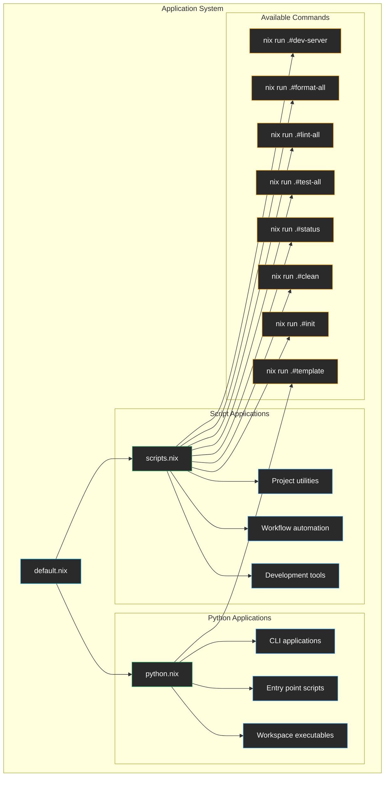

# Applications

This directory contains the modular application system that provides runnable apps through `nix run` commands, including Python workspace applications and custom development scripts.

## Architecture



## Application Modules

### 📋 [default.nix](./default.nix)
**Main orchestrator** that combines Python applications and custom scripts.

**Features:**
- Imports Python workspace applications
- Imports custom development scripts
- Provides unified app interface
- Supports easy extension with new app types

### 🐍 [python.nix](./python.nix)
**Python workspace applications** automatically generated from packages with entry points.

**Functionality:**
- Discovers workspace packages with executable entry points
- Creates app definitions pointing to installed binaries
- Links to the corresponding package virtual environments
- Filters to only packages that have actual executables

**Generated Apps:**
- `template`: Main workspace application (if it has an entry point)
- Additional workspace apps (for multi-package workspaces)

### 🔧 [scripts.nix](./scripts.nix)
**Custom development scripts** and workflow automation tools.

## Available Applications

### Project Management

#### init - Project Initialization
Initializes the development environment and sets up project structure.

```bash
nix run .#init
```

**Features:**
- Sets up git hooks
- Configures development environment
- Validates project structure
- Provides setup guidance

#### clean - Project Cleanup
Cleans all project artifacts and temporary files.

```bash
nix run .#clean
```

**Features:**
- Removes Python cache files
- Cleans build artifacts
- Removes test/coverage files
- Cleans Nix build results

#### status - Environment Status
Shows comprehensive development environment information.

```bash
nix run .#status
```

**Output includes:**
- Python and UV versions
- Git branch and status
- Project metadata
- Virtual environment info

### Development Workflow

#### test-all - Comprehensive Testing
Runs all available test suites and checks.

```bash
nix run .#test-all
```

**Executes:**
- `nix flake check` for Nix-level validation
- `pytest --cov` for Python test suite (if available)
- Comprehensive test reporting

#### lint-all - Code Quality Checks
Runs all linting tools to check code quality.

```bash
nix run .#lint-all
```

**Runs:**
- `ruff check` for Python linting
- `ruff format --check` for formatting validation
- `mypy` for type checking (if available)

#### format-all - Code Formatting
Automatically formats all code to maintain consistency.

```bash
nix run .#format-all
```

**Applies:**
- `ruff format` for Python code formatting
- Fallback to `black` if ruff unavailable
- Consistent code style across project

### Web Development

#### dev-server - Development Server
Starts the development server for web service projects.

```bash
nix run .#dev-server
```

**Features:**
- Auto-detects FastAPI/Flask/Django projects
- Starts with `uvicorn` for FastAPI applications
- Hot reload enabled for development
- Configurable host and port

## Usage Examples

### Basic Usage
```bash
# Run any application
nix run .#<app-name>

# List all available applications
nix flake show | grep "app:"

# Get help for an application (if supported)
nix run .#template -- --help
```

### Development Workflow
```bash
# Check project status
nix run .#status

# Clean and prepare for fresh start
nix run .#clean

# Run comprehensive tests
nix run .#test-all

# Format code before committing
nix run .#format-all

# Check code quality
nix run .#lint-all
```

### Continuous Integration
```bash
# CI pipeline script
nix run .#clean        # Clean artifacts
nix run .#test-all     # Run all tests
nix run .#lint-all     # Check code quality
nix run .#format-all   # Verify formatting
```

## Extending the System

### Adding Custom Scripts

1. **Add to scripts.nix**:
```nix
my-workflow = {
  type = "app";
  program = toString (pkgs.writeShellScript "my-workflow" ''
    set -euo pipefail
    echo "Running my custom workflow..."
    
    # Your workflow logic here
    echo "✅ Workflow completed!"
  '');
};
```

2. **Use the new app**:
```bash
nix run .#my-workflow
```

### Adding Complex Applications

1. **Create app from package**:
```nix
# In scripts.nix
my-tool = mkAppFromPackage outputs.packages.${pkgs.system}.my-custom-package "my-tool";
```

2. **Create app with specific logic**:
```nix
my-complex-app = {
  type = "app";
  program = toString (pkgs.writeShellScript "my-complex-app" ''
    # Complex multi-step workflow
    echo "Step 1: Preparation"
    # ... preparation logic
    
    echo "Step 2: Execution"  
    # ... execution logic
    
    echo "Step 3: Cleanup"
    # ... cleanup logic
  '');
};
```

### Adding Apps from External Packages

1. **Reference external tools**:
```nix
external-tool = {
  type = "app";
  program = "${pkgs.some-external-package}/bin/tool-name";
};
```

2. **Wrap external tools**:
```nix
wrapped-tool = {
  type = "app";
  program = toString (pkgs.writeShellScript "wrapped-tool" ''
    export TOOL_CONFIG="$PWD/config"
    exec ${pkgs.external-tool}/bin/external-tool "$@"
  '');
};
```

## Helper Functions

### mkApp
Creates a basic app definition:
```nix
mkApp = program: {
  type = "app";
  inherit program;
};
```

### mkAppFromPackage
Creates an app from a package with a specific binary:
```nix
mkAppFromPackage = pkg: bin: {
  type = "app";
  program = "${pkg}/bin/${bin}";
};
```

## Integration with Packages

Applications in this directory automatically reference packages from the [packages system](../packages/README.md). This creates a seamless workflow where:

1. Packages define the tools and utilities
2. Apps provide runnable interfaces to those tools
3. Users interact through simple `nix run` commands

## App Categories

### Python Applications
- **Source**: Generated from workspace packages with entry points
- **Purpose**: Run Python applications with proper environments
- **Dependencies**: Full workspace dependency resolution

### Development Scripts
- **Source**: Custom shell scripts in scripts.nix
- **Purpose**: Automate common development tasks
- **Dependencies**: Access to development tools and environment

### Workflow Automation
- **Source**: Multi-step shell scripts
- **Purpose**: Complex development workflows (CI/CD, deployment, etc.)
- **Dependencies**: Multiple tools orchestrated together

### External Tool Wrappers
- **Source**: Wrapped external packages
- **Purpose**: Provide consistent interface to external tools
- **Dependencies**: External packages with custom configuration

## Benefits

- ✅ **Convenient**: Simple `nix run` interface for all tools
- ✅ **Consistent**: Uniform app interface across different tool types
- ✅ **Discoverable**: All apps visible through `nix flake show`
- ✅ **Reproducible**: Apps run in consistent environments
- ✅ **Extensible**: Easy to add new apps and workflows
- ✅ **Integrated**: Seamless integration with package system
