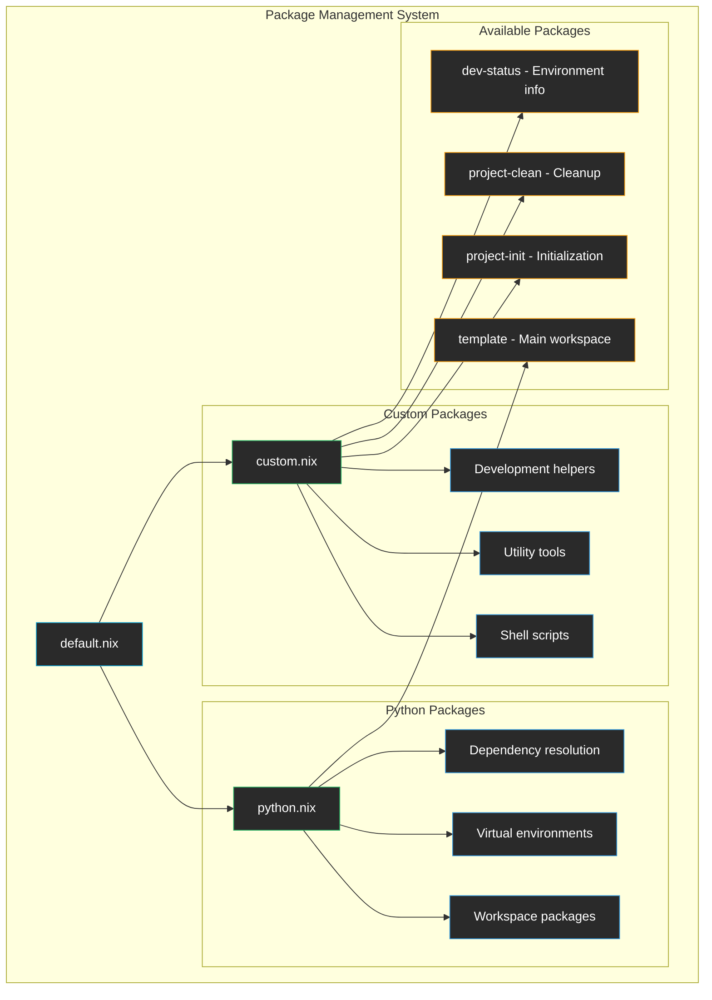

# Packages

This directory contains the modular package management system that creates both Python workspace packages and custom utility packages.

## Architecture



## Package Modules

### 📋 [default.nix](./default.nix)
**Main orchestrator** that combines all package types into a single attribute set.

**Features:**
- Imports and merges Python workspace packages
- Imports and merges custom utility packages
- Provides unified package interface
- Supports easy extension with new package types

### 🐍 [python.nix](./python.nix)
**Python workspace packages** automatically generated from UV workspace configuration.

**Functionality:**
- Discovers all workspace packages with UV
- Creates virtual environments for each package
- Resolves dependencies using UV's dependency resolver
- Filters to only buildable packages (those with src/ directories)

**Generated Packages:**
- `template`: Main workspace package with its dependencies
- Additional workspace packages (if any are added to the project)

### 🔧 [custom.nix](./custom.nix)
**Custom utility packages** including shell scripts and development tools.

**Current Packages:**

#### project-init
Initializes the development environment:
- Sets up git hooks
- Configures development settings  
- Validates project structure

```bash
nix run .#init
# or
nix build .#project-init && ./result/bin/project-init
```

#### project-clean
Cleans project artifacts:
- Removes Python cache files (`__pycache__`, `*.pyc`)
- Cleans build artifacts (`build/`, `dist/`, `*.egg-info/`)
- Removes coverage and test artifacts
- Cleans Nix build results

```bash
nix run .#clean
# or  
nix build .#project-clean && ./result/bin/project-clean
```

#### dev-status
Shows development environment status:
- Python and UV versions
- Git branch and status
- Project information from pyproject.toml
- Virtual environment information

```bash
nix run .#status
# or
nix build .#dev-status && ./result/bin/dev-status
```

## Usage Examples

### Building Packages
```bash
# Build the main workspace package
nix build .#template

# Build a custom utility
nix build .#project-clean

# Build all packages
nix build .#"*"
```

### Installing Packages
```bash
# Install utility globally (if using nix profile)
nix profile install .#dev-status

# Install to local bin directory
nix build .#project-init
cp result/bin/project-init ~/.local/bin/
```

### Package Development
```bash
# Enter development environment
nix develop

# Build and test custom package
nix build .#project-clean
./result/bin/project-clean
```

## Extending the System

### Adding Custom Shell Scripts

1. **Add to custom.nix**:
```nix
# In custom.nix
my-script = mkShellScript "my-script" ''
  #!/usr/bin/env bash
  set -euo pipefail
  
  echo "Running my custom script..."
  # Your script logic here
'';
```

2. **Use the script**:
```bash
nix run .#my-script
# or
nix build .#my-script && ./result/bin/my-script
```

### Adding Custom Derivations

1. **Add to custom.nix**:
```nix
# In custom.nix
my-tool = mkCustomPackage "my-tool" {
  version = "1.0.0";
  src = ./path/to/source;
  buildInputs = with pkgs; [ dependencies ];
  buildPhase = ''
    # Build commands
  '';
  installPhase = ''
    # Install commands
    install -D my-binary $out/bin/my-tool
  '';
};
```

### Adding New Module Types

1. **Create new module** (e.g., `containers.nix`):
```nix
# containers.nix
{ pkgs, ... }: {
  my-container = pkgs.dockerTools.buildImage {
    name = "my-app";
    config = {
      Cmd = [ "${my-app}/bin/my-app" ];
    };
  };
}
```

2. **Import in default.nix**:
```nix
containerPackages = import ./containers.nix { inherit pkgs; };

# In the return set:
// containerPackages
```

## Package Categories

### Python Workspace Packages
- **Purpose**: Python packages defined in the workspace
- **Source**: Generated from UV workspace configuration
- **Dependencies**: Resolved by UV dependency resolver
- **Installation**: Virtual environments with all dependencies

### Shell Script Packages
- **Purpose**: Quick utility scripts for development tasks
- **Source**: Defined in custom.nix as shell scripts
- **Dependencies**: Access to all system packages
- **Installation**: Single binary with all dependencies bundled

### Custom Derivations
- **Purpose**: Complex packages requiring build processes
- **Source**: Custom build logic in Nix expressions
- **Dependencies**: Explicit dependency specification
- **Installation**: Standard Nix package installation

## Helper Functions

### mkShellScript
Creates a shell script package:
```nix
mkShellScript = name: script: pkgs.writeShellScriptBin name script;
```

### mkCustomPackage
Creates a custom derivation with sensible defaults:
```nix
mkCustomPackage = name: attrs: stdenv.mkDerivation (attrs // {
  pname = name;
  name = "${name}-${attrs.version or "1.0.0"}";
});
```

## Integration with Apps

Packages in this directory are automatically made available as runnable apps through the [apps system](../apps/README.md). Shell script packages become `nix run` targets automatically.

## Benefits

- ✅ **Modular**: Clear separation between Python and custom packages
- ✅ **Extensible**: Easy to add new package types and utilities
- ✅ **Consistent**: Unified interface for all package types
- ✅ **Reusable**: Packages can be used in multiple contexts
- ✅ **Maintainable**: Each package type has its own module
- ✅ **Discoverable**: All packages visible through `nix flake show`
