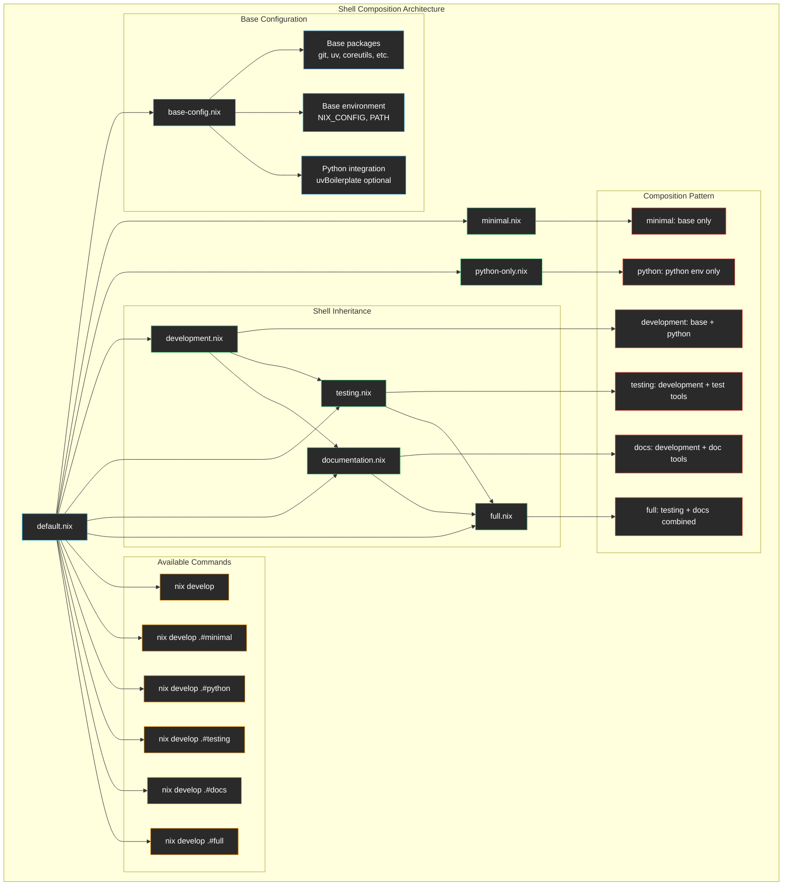

# Development Shells

This directory contains the modular development shell system with a composition-based architecture that allows for clean inheritance and easy extensibility.

## Architecture



## Shell Modules

### 🏗️ [default.nix](./default.nix)
**Main orchestrator** that creates all shell environments using composition.

**Features:**
- Imports base configuration and all shell modules
- Creates shell derivations using `mkShell` helper
- Exports only shell derivations (for flake compatibility)
- Provides clean composition interface

### ⚙️ [base-config.nix](./base-config.nix)
**Foundation configuration** that all other shells build upon.

**Provides:**
- **Base packages**: Essential development tools (git, uv, ripgrep, etc.)
- **Base environment**: NIX_CONFIG and PATH setup
- **Python integration**: Optional uvBoilerplate integration
- **Composable structure**: Can be used by any shell configuration

**Base Tools Included:**
```nix
git, nodejs-slim, pnpm, uv
coreutils, findutils, gnugrep, gnused
ripgrep, fd, bat, eza, htop, jq
watch, curl, wget, tree, unzip, zip
```

### 🔬 [minimal.nix](./minimal.nix)
**Minimal shell** with just base tools, no Python integration.

**Use Cases:**
- Quick file operations
- Git operations without Python overhead
- Testing base tool functionality
- Lightweight development tasks

### 🐍 [python-only.nix](./python-only.nix)
**Python-only shell** with just the Python environment, no base tools.

**Use Cases:**
- Pure Python development
- Testing Python package resolution
- Minimal Python environment debugging
- CI/CD environments where only Python is needed

### 🚀 [development.nix](./development.nix)
**Default development shell** combining base tools and Python environment.

**Features:**
- Base tools + Python environment
- Complete development setup
- Default shell for `nix develop`
- Foundation for specialized shells

### 🧪 [testing.nix](./testing.nix)
**Testing-focused shell** using uv2nix managed environment with testing dependencies.

**Python Dependencies (from pyproject.toml):**
- **pytest**: Test runner with pytest-cov for coverage
- **Code quality**: black, isort for formatting
- **Coverage**: coverage[toml] for detailed reporting

**System Tools:**
- **Validation tools**: html-tidy, xmlstarlet for testing HTML/XML output

**Environment Variables:**
```bash
PYTEST_DISABLE_PLUGIN_AUTOLOAD=1  # More predictable test runs
COVERAGE_CORE=sysmon              # Better coverage tracking
```

**Dependencies managed by:** `workspace.deps.all // { template = ["testing"]; }` from pyproject.toml

### 📚 [documentation.nix](./documentation.nix)
**Documentation-focused shell** using uv2nix managed environment with docs dependencies.

**Python Dependencies (from pyproject.toml):**
- **Sphinx ecosystem**: sphinx, sphinx-rtd-theme, myst-parser
- **API documentation**: pdoc for automatic API docs

**System Tools:**
- **Markdown processing**: pandoc for format conversion
- **Diagram generation**: graphviz, plantuml

**Environment Variables:**
```bash
SPHINXOPTS=-W  # Treat warnings as errors
```

**Dependencies managed by:** `workspace.deps.all // { template = ["docs"]; }` from pyproject.toml

### 🎯 [full.nix](./full.nix)
**Complete shell** combining testing and documentation environments.

**Features:**
- All tools from testing and documentation shells
- Deduplicated package list for efficiency
- Combined environment variables
- Everything needed for complete development

## Usage Examples

### Basic Development
```bash
# Default development environment
nix develop

# Check available tools
which python uv git ripgrep
```

### Testing Workflow
```bash
# Enter testing environment
nix develop .#testing

# Run tests with coverage
pytest --cov tests

# Check code formatting
black --check src/
```

### Documentation Workflow
```bash
# Enter documentation environment  
nix develop .#docs

# Build documentation
sphinx-build docs/ docs/_build/

# Generate API docs
pdoc src/mypackage/
```

### Full Development Workflow
```bash
# Enter complete environment
nix develop .#full

# Run full development cycle
pytest --cov tests        # Testing
black src/                # Formatting  
sphinx-build docs/        # Documentation
```

## Composition Pattern

### Base Configuration Pattern
```nix
# base-config.nix provides foundation
{
  packages = [ /* base tools */ ];
  env = { /* base environment */ };
  shellHook = "/* base setup */";
  python = { /* optional python integration */ };
}
```

### Shell Composition Pattern
```nix
# Each shell composes base with additions
{ pkgs, baseConfig, ... }: let
  devConfig = import ./development.nix { inherit pkgs baseConfig; };
  additionalPackages = [ /* specialized tools */ ];
  additionalEnv = { /* specialized environment */ };
in {
  packages = devConfig.packages ++ additionalPackages;
  env = devConfig.env // additionalEnv;
  shellHook = devConfig.shellHook + "/* additional setup */";
}
```

### UV2NIX Specialized Shell Pattern
```nix
# Specialized shells with uv2nix managed dependencies
{ pkgs, baseConfig, uvBoilerplate, ... }: let
  inherit (baseConfig) python;
  inherit (uvBoilerplate) workspace editablePythonSet uvShellSet;

  # Create virtualenv with specific dependency group
  specializedVirtualenv = editablePythonSet.mkVirtualEnv
    "template-specialized-env"
    (workspace.deps.all // { template = ["dependency-group"]; });

  systemPackages = [ /* additional system tools */ ];
in {
  packages = uvShellSet.packages ++ [specializedVirtualenv] ++ systemPackages;
  env = uvShellSet.env // { /* additional environment */ };
  shellHook = uvShellSet.shellHook + "/* additional setup */";
}
```

## Extending the System

### Adding a New Shell

#### Option 1: System Tools Only (Traditional Pattern)
1. **Create shell file** (e.g., `deployment.nix`):
```nix
{ pkgs, baseConfig, ... }: let
  devConfig = import ./development.nix { inherit pkgs baseConfig; };
in {
  packages = devConfig.packages ++ (with pkgs; [
    kubectl
    terraform
    awscli2
  ]);
  env = devConfig.env // {
    KUBECONFIG = "~/.kube/config";
  };
  shellHook = devConfig.shellHook + ''
    echo "🚀 Deployment environment loaded"
  '';
}
```

#### Option 2: Python Dependencies (UV2NIX Pattern)
1. **Add dependency group to pyproject.toml**:
```toml
[project.optional-dependencies]
deployment = [
    "kubernetes>=28.0",
    "boto3>=1.34",
    "pydantic>=2.0",
]
```

2. **Create shell file** (e.g., `deployment.nix`):
```nix
{ pkgs, baseConfig, uvBoilerplate, ... }: let
  inherit (baseConfig) python;
  inherit (uvBoilerplate) workspace editablePythonSet uvShellSet;

  deploymentVirtualenv = editablePythonSet.mkVirtualEnv
    "template-deployment-env"
    (workspace.deps.all // { template = ["deployment"]; });
in {
  packages = uvShellSet.packages ++ [deploymentVirtualenv] ++ (with pkgs; [
    kubectl
    terraform
    awscli2
  ]);
  env = uvShellSet.env // {
    KUBECONFIG = "~/.kube/config";
  };
  shellHook = uvShellSet.shellHook + ''
    echo "🚀 Deployment environment loaded with Python packages"
  '';
}
```

3. **Add to default.nix**:
```nix
deploymentConfig = import ./deployment.nix { inherit pkgs baseConfig uvBoilerplate; };

# In the return set:
deployment = mkShell deploymentConfig;
```

### Customizing Base Configuration

Modify `base-config.nix` to add tools needed across all environments:
```nix
packages = with pkgs; [
  # Existing tools...
  
  # Add new base tools
  direnv
  starship
  zoxide
];
```

## Dependency Management Approaches

### Traditional Approach (System Tools)
- Uses Nix packages directly from nixpkgs
- Good for system tools, CLI utilities, and non-Python dependencies
- Examples: git, kubectl, pandoc, graphviz

### UV2NIX Approach (Python Dependencies)
- Manages Python packages through pyproject.toml optional-dependencies
- Uses UV for dependency resolution and virtual environments
- Integrates with the uv2nix system for consistent Python environments
- Examples: pytest, sphinx, black, mypy

### Best Practice
- Use **UV2NIX approach** for Python packages that can be defined in pyproject.toml
- Use **traditional approach** for system tools and non-Python dependencies
- This ensures Python dependencies are consistently managed by UV while system tools remain available

## Design Benefits

- ✅ **Composable**: Each shell builds upon others cleanly
- ✅ **DRY**: No duplication of common configuration
- ✅ **Extensible**: Easy to add new specialized shells
- ✅ **Maintainable**: Changes propagate through inheritance
- ✅ **Efficient**: Shared base reduces evaluation time
- ✅ **Clear**: Obvious hierarchy and dependencies
- ✅ **Consistent**: Python dependencies managed by UV, system tools by Nix
