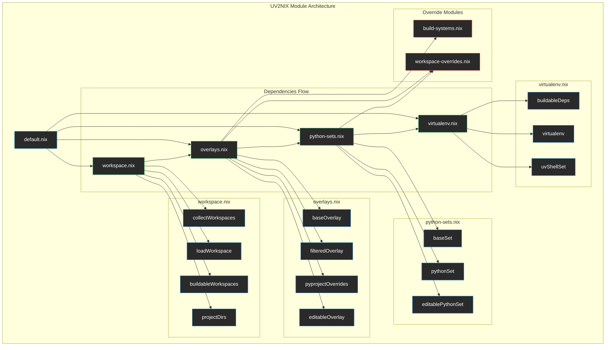

# UV2NIX Integration Module

This directory contains the modular UV+Nix integration system that handles workspace discovery, package overlays, Python environment construction, and virtual environment creation.

## Architecture



## Module Breakdown

### 📋 [default.nix](./default.nix)
**Main orchestrator** that combines all UV2NIX modules into a single interface.

**Responsibilities:**
- Imports and coordinates all submodules
- Provides the same interface as the original monolithic `uv.nix`
- Uses non-recursive attribute sets to avoid evaluation issues

**Exports:**
- All workspace data (workspaces, buildable packages, etc.)
- Python package sets (base, python, editable)
- Virtual environments and shell configurations

### 🔍 [workspace.nix](./workspace.nix)
**Workspace discovery and management with support for new project spec**

**Functions:**
- `toLegacyProject`: Converts new project spec to legacy format for compatibility
- `collectWorkspaces`: Recursively discovers all workspace packages
- `loadWorkspace`: Loads UV workspace configurations
- `buildableWorkspaces`: Filters packages that have src directories
- `sanitizeName`: Converts project names to valid Python package names

**Key Data:**
- `allWorkspaces`: All discovered workspace packages (from new spec format)
- `projectDirs`: Mapping of project names to directory names
- `workspace`: Root workspace configuration (loaded from `projectRoot`)
- `workspaces`: Individual workspace configurations

**New Spec Support:**
- Handles `projectName`, `projectRoot`, `projectDir` fields
- Supports `workspaces` list for monorepo layouts
- Respects `emptyRoot` flag for workspace-only repositories

### 🔄 [overlays.nix](./overlays.nix)
**Package overlay creation and management**

**Overlays:**
- `baseOverlay`: Raw pyproject overlay from UV workspace
- `overlay`: Filtered overlay excluding packages without src directories
- `pyprojectOverrides`: Combines build system and workspace overrides
- `editableOverlay`: Makes workspace packages editable in development

**Integration:**
- Imports build system overrides for problematic packages
- Imports workspace overrides for testing and editable installs
- Handles both external dependencies and workspace packages

### 🐍 [python-sets.nix](./python-sets.nix)
**Python package set construction**

**Package Sets:**
- `baseSet`: Raw Python package set from pyproject-nix
- `pythonSet`: Base set with all overlays applied
- `editablePythonSet`: Python set with editable workspace packages

**Composition:**
- Applies pyproject-build-systems overlay
- Applies filtered package overlay
- Applies build system and workspace overrides
- Applies editable package overlay for development

### 🌍 [virtualenv.nix](./virtualenv.nix)
**Virtual environment and shell configuration**

**Components:**
- `buildableDeps`: Dependencies filtered to buildable packages only
- `virtualenv`: Main development virtual environment
- `uvShellSet`: Complete shell configuration with UV integration

**Shell Integration:**
- Configures UV environment variables
- Sets up repository root detection
- Provides clean Python environment for development

### 🔧 [build-systems.nix](./build-systems.nix)
**Build system overrides for problematic packages**

**Supported Packages:**
- **pygraphviz**: Adds graphviz and pkg-config dependencies
- **numpy**: Adds meson, ninja, and cython build dependencies  
- **numba**: Adds TBB threading library

**Pattern:**
- Declarative override specifications
- Automatic application to affected packages
- Easy to extend for new problematic packages

### 📦 [workspace-overrides.nix](./workspace-overrides.nix)
**Workspace package overrides for testing and development with new spec support**

**Overrides:**
- `mkWorkspaceOverrides`: Adds pytest test environments to packages
- `mkEditableOverrides`: Makes workspace packages editable for development

**Features:**
- Automatic test environment creation with coverage
- Proper handling of editable installs
- Source filtering for efficient builds
- **New spec integration**: Uses `projectName`, `projectRoot`, `projectDir` fields
- **Empty root handling**: Respects `emptyRoot` flag when processing root package
- **Flexible source paths**: Uses `projectDir` when specified, defaults to conventional layout

## Design Principles

### 1. **Single Responsibility**
Each module handles one aspect of the UV+Nix integration:
- workspace.nix: Discovery
- overlays.nix: Package management
- python-sets.nix: Environment construction
- virtualenv.nix: Shell integration

### 2. **Clear Data Flow**
Data flows in one direction through the modules:
```
workspace → overlays → python-sets → virtualenv
```

### 3. **Non-Recursive Architecture**
Uses `let` expressions and explicit imports instead of `rec` attribute sets to avoid evaluation issues and circular dependencies.

### 4. **Composable Overrides**
Build system and workspace overrides are separate modules that can be independently modified and extended.

### 5. **Extensibility**
New workspace types, build system overrides, or integration patterns can be added without modifying existing modules.

## Usage in Flake

```nix
# In flake.nix
uvBoilerplate = import nix/uv2nix {
  inherit inputs system pythonProject pkgs;
};

# Access any component
devShells.default = pkgs.mkShell {
  packages = uvBoilerplate.uvShellSet.packages;
  env = uvBoilerplate.uvShellSet.env;
  shellHook = uvBoilerplate.uvShellSet.shellHook;
};
```

## Benefits

- ✅ **Maintainable**: Clear separation makes debugging easier
- ✅ **Non-Recursive**: Avoids evaluation pitfalls of recursive attribute sets
- ✅ **Extensible**: Easy to add new workspace types or overrides
- ✅ **Testable**: Each module can be tested independently
- ✅ **Reusable**: Components can be imported by other Nix configurations
- ✅ **Fast**: Efficient evaluation without unnecessary recursion
