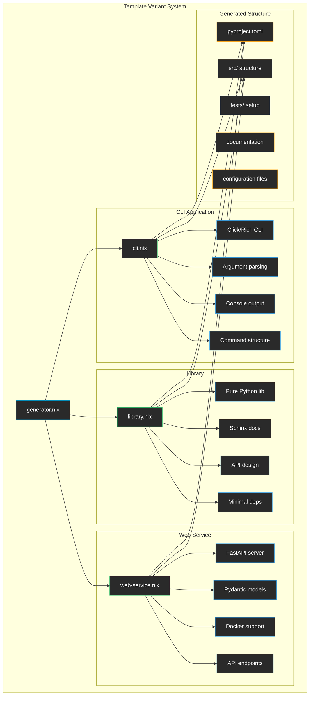

# Project Template Variants

This directory contains different project template configurations that can generate specialized Python projects with different architectures and dependencies.

## Available Templates



## Template Variants

### 🖥️ [cli.nix](./cli.nix)
**Command-line application template** for building interactive CLI tools.

**Key Features:**
- **Click framework**: Modern Python CLI framework with decorators
- **Rich output**: Beautiful terminal output with colors and formatting
- **Typer integration**: Type hints for CLI arguments
- **Argument parsing**: Comprehensive command-line interface
- **Console utilities**: Progress bars, tables, and rich formatting

**Dependencies:**
```toml
dependencies = [
    "click>=8.0",
    "rich>=13.0", 
    "typer>=0.9"
]
```

**Project Structure:**
```
src/{name}/
├── __init__.py          # Package initialization
├── main.py              # CLI entry point with Click
├── cli/
│   ├── __init__.py
│   └── commands.py      # Additional CLI commands
```

**Example Generated Code:**
```python
@click.group()
@click.version_option(version=__version__)
@click.option("--verbose", "-v", is_flag=True)
def cli(ctx: click.Context, verbose: bool) -> None:
    """CLI application description"""
    
@cli.command()
@click.argument("name", default="World")
def greet(name: str) -> None:
    """Greet someone."""
    console.print(f"[bold green]Hello, {name}![/bold green]")
```

### 📚 [library.nix](./library.nix)
**Python library template** for creating reusable packages and modules.

**Key Features:**
- **Pure library design**: Minimal dependencies for maximum compatibility
- **Sphinx documentation**: Professional documentation generation
- **API-focused structure**: Clear separation of public and private APIs
- **Type hints**: Full type annotation support
- **Testing framework**: Comprehensive test setup

**Dependencies:**
```toml
dependencies = []  # Minimal for maximum compatibility

[project.optional-dependencies]
dev = ["pytest>=7.0", "mypy>=1.0", "ruff>=0.1"]
docs = ["sphinx>=7.0", "sphinx-rtd-theme>=1.3"]
```

**Project Structure:**
```
src/{name}/
├── __init__.py          # Public API exports
├── core.py              # Main functionality
├── utils.py             # Utility functions
└── exceptions.py        # Custom exceptions

docs/
├── index.md             # Main documentation
└── conf.py              # Sphinx configuration
```

**Example Generated Code:**
```python
class MyLibrary:
    """Main class for library functionality."""
    
    def __init__(self, config: Optional[dict[str, Any]] = None) -> None:
        self.config = config or {}
    
    def process(self, data: Any) -> Any:
        """Process the given data."""
        return data
```

### 🌐 [web-service.nix](./web-service.nix)
**Web service template** for building FastAPI-based microservices and APIs.

**Key Features:**
- **FastAPI framework**: Modern, fast web framework with automatic OpenAPI
- **Pydantic models**: Type-safe request/response models
- **Async support**: Built-in async/await support
- **Docker integration**: Container deployment ready
- **Settings management**: Environment-based configuration

**Dependencies:**
```toml
dependencies = [
    "fastapi>=0.104",
    "uvicorn[standard]>=0.24",
    "pydantic>=2.5",
    "pydantic-settings>=2.1",
    "httpx>=0.25"
]
```

**Project Structure:**
```
src/{name}/
├── __init__.py          # Package initialization
├── main.py              # FastAPI application
├── config.py            # Settings and configuration
├── api/
│   ├── __init__.py
│   └── router.py        # API routes
├── models.py            # Pydantic models
└── services.py          # Business logic

# Additional files
├── .env.example         # Environment template
├── docker-compose.yml   # Development services
└── Dockerfile           # Container definition
```

**Example Generated Code:**
```python
app = FastAPI(
    title="My Service",
    version=__version__,
    description="Web service description"
)

@app.get("/health")
async def health_check():
    return {"status": "healthy", "version": __version__}

@app.post("/api/v1/process", response_model=ProcessResponse)
async def process_data(request: ProcessRequest):
    return ProcessResponse(result=request.data)
```

### 🔧 [generator.nix](./generator.nix)
**Template generation system** that creates and customizes project templates.

**Features:**
- **Template selection**: Choose from available variants
- **Project customization**: Name, description, and configuration
- **File generation**: Creates complete project structure
- **Dependency management**: Proper pyproject.toml generation
- **Configuration merging**: Combines template-specific and base settings

**Generation Process:**
```nix
generateProject = variant: name: description: let
  config = variant { inherit name description; };
in {
  pyproject = /* Generated pyproject.toml */;
  src_files = /* Generated source code */;
  additional_files = /* Extra files (Docker, etc.) */;
}
```

## Usage Examples

### Generating a CLI Application
```bash
# Using the generator (when implemented)
nix run .#generate-cli myapp "A command-line tool"

# Manual setup
cp -r template/ myapp/
cd myapp/
# Edit pyproject.toml, rename directories, etc.
```

### Generating a Library
```bash
# Using the generator
nix run .#generate-library mylib "A reusable library"

# The generated library includes:
# - Clean API design
# - Sphinx documentation setup
# - Comprehensive testing
```

### Generating a Web Service
```bash
# Using the generator
nix run .#generate-web-service myapi "A REST API service"

# The generated service includes:
# - FastAPI application
# - Docker setup
# - Environment configuration
# - API documentation
```

## Template Structure

### Common Elements

All templates share these base configurations:

**pyproject.toml Structure:**
```toml
[project]
name = "{name}"
description = "{description}"
requires-python = ">=3.13"
classifiers = [/* template-specific */]

[build-system]
requires = ["hatchling", "editables"]
build-backend = "hatchling.build"

[tool.ruff]
target-version = "py313"
line-length = 100

[tool.mypy]
python_version = "3.13"
strict = true

[tool.pytest.ini_options]
testpaths = ["tests"]
addopts = ["--cov", "--strict-markers"]
```

### Customization Points

Each template customizes:
- **Dependencies**: Framework-specific requirements
- **Project structure**: File organization patterns
- **Entry points**: CLI commands, web servers, etc.
- **Additional files**: Docker, configuration, documentation

## Extension Guide

### Adding a New Template

1. **Create template file** (e.g., `data-science.nix`):
```nix
{ name, description ? "A data science project", ... }: {
  project = {
    inherit name description;
    dependencies = [
      "pandas>=2.0"
      "numpy>=1.24"
      "matplotlib>=3.7"
      "jupyter>=1.0"
    ];
    scripts = {
      "jupyter-lab" = "jupyter lab";
    };
  };
  
  src_structure = {
    "__init__.py" = "# Data science package";
    "analysis.py" = "# Analysis functions";
    "visualization.py" = "# Plotting utilities";
  };
}
```

2. **Add to generator.nix**:
```nix
variants = {
  cli = import ./cli.nix;
  library = import ./library.nix;
  web-service = import ./web-service.nix;
  data-science = import ./data-science.nix;  # Add new variant
};
```

### Template Best Practices

1. **Minimal Dependencies**: Start with essential packages only
2. **Clear Structure**: Organize code logically from the start
3. **Configuration**: Include environment and settings management
4. **Documentation**: Provide README and API docs templates
5. **Testing**: Include test structure and CI configuration
6. **Type Safety**: Use type hints and mypy configuration
7. **Code Quality**: Include ruff, black, and other quality tools

## Benefits

- ✅ **Rapid Prototyping**: Quick project initialization
- ✅ **Best Practices**: Templates follow Python packaging standards
- ✅ **Consistency**: Standardized project structure across templates
- ✅ **Extensible**: Easy to add new project types
- ✅ **Integrated**: Works with the existing Nix infrastructure
- ✅ **Customizable**: Templates can be modified for specific needs
