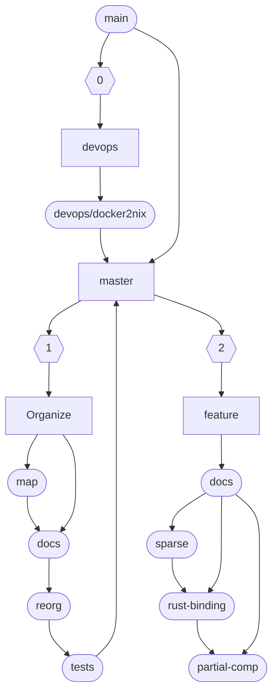

# Workflow

Main workflow chart, with each feature in a given stage.

## Stage 0: Infrastructure Setup
- **devops/docker2nix**: Convert Docker-based build system to Nix for reproducible builds
- Establish core build infrastructure
- Merge foundational changes to master

## Stage 1: Organization and Analysis
- **organize/map**: Generate comprehensive organizational map of LAPACK codebase
  - Parse all Fortran source files using `fortran-src` to extract AST
  - Extract procedure definitions, call relationships, and file locations
  - Design graph schema for routine dependencies and relationships
  - Process LAPACK naming conventions (precision prefixes: S/D/C/Z)
  - Create importable format for graph database (Neo4j)
  - Handle parser errors and edge cases gracefully
  - Generate visualization of code structure and dependencies
- **organize/docs**: Restructure and improve documentation
- **organize/reorg**: Reorganize code structure based on analysis
- **organize/tests**: Ensure test coverage through reorganization

## Stage 2: Feature Development
- **feature/docs**: Enhanced documentation system
- **feature/sparse**: Sparse matrix support improvements
- **feature/rust-binding**: Rust language bindings
- **feature/partial-comp**: Partial compilation capabilities

